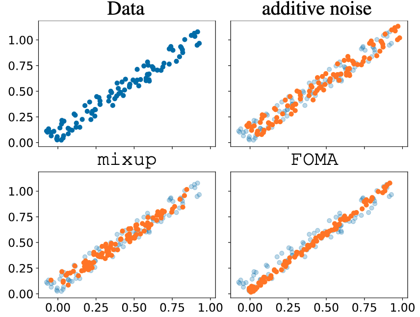
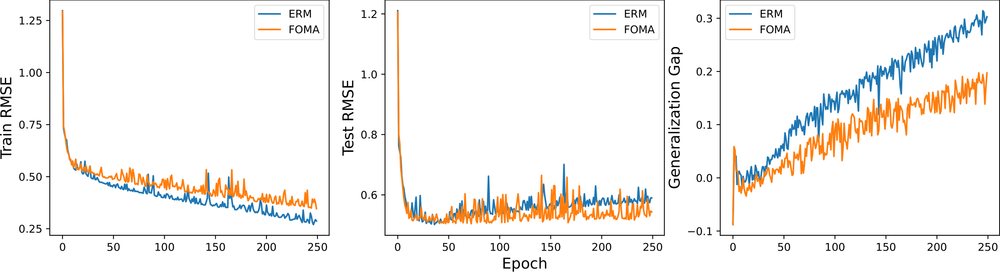

# First-Order Manifold Data Augmentation for Regression Learning

Official implementation of "First-Order Manifold Data Augmentation for Regression Learning" (ICML 2024)

<div align=center></div>


The repository is cloned from the [C-Mixup Repository](https://github.com/yaodongyu/CMixup) (Yao et al., 2022) and has been modified to incorporate FOMA to the experimental setup.
## Overview

FOMA is a data-driven approach for data augmentation in regression tasks. Key features:
- Samples new examples from tangent planes of the training distribution
- Aligns with neural networks' tendency to capture dominant features
- Improves generalization across multiple architectures and datasets
- Fully differentiable implementation


<div align=center></div>

## Example Usage

```python
def scale(A, k, lam):
    U, s, Vt = torch.linalg.svd(A, full_matrices=False)
    lam_repeat = lam.repeat(s.shape[-1] - k)
    lam_ones = torch.ones(k)
    s = s * torch.cat((lam_ones, lam_repeat))
    A = U @ torch.diag(s) @ Vt
    return A

# X, Y are in batch x feats
for (X, Y) in loader:
    lam = torch.distributions.beta.Beta(alpha, alpha).sample()
    A = torch.concatenate((X, Y), axis=1)
    A = scale(A, k, lam)
    X, Y = A[:, :n], A[:, n:]
    optimizer.zero_grad()
    loss(net(X), Y).backward()
    optimizer.step()
```

## Experiments

The code is organized such that all components, except for Echo and PovertyMap, are placed in the `src` folder. Since the Echo and PovertyMap datasets build upon distinct codebases, they are located in the `echo` and `povertymap` folders, respectively.


First, download the datasets from [C-Mixup](https://github.com/yaodongyu/CMixup) following the instructions in their README file. Our setup aligns closely with their approach to ensure a fair comparison. After downloading, place the data folders into `src/data/` and execute the following commands:

`python main.py --dataset Airfoil`

`python main.py --dataset NO2`

`python main.py --dataset TimeSeries-exchange_rate`

`python main.py --dataset TimeSeries-electricity`

`python main.py --dataset RCF_MNIST`

`python main.py --dataset CommunitiesAndCrime`

`python main.py --dataset SkillCraft --method`

`python main.py --dataset Dti_dg --method`

## PovertyMap
For the "PovertyMap" dataset, we utilized the code from the CMixup repository and adapted it to integrate FOMA into the training process. Begin by navigating to the relevant folder using cd PovertyMap. The dataset will be automatically downloaded when the code is executed. Use the following command to run the code:

`python main.py`

## EchoNet
For the "Echo" dataset, we utilized the code from the CMixup repository and adapted it to integrate FOMA into the training process. Begin by navigating to the relevant folder using cd EchoNet. 
You need to follow the download instructions from the CMixup repository. The data set should be placed into `../../EchoNet-Dynamic/` directory.

For the preparation you need to install the echonet environment and complete segmentation tasks by running the commands:

`pip install --upgrade --user .`

`python echonet/__main__.py segmentation --save_video`


The command to run FOMA on EchoNet is:

`echonet video  --num_workers 0 --run_test True`


## Citation

```bibtex
@inproceedings{kaufman2024firstorder,
  title={First-Order Manifold Data Augmentation for Regression Learning},
  author={Kaufman, Ilya and Azencot, Omri},
  booktitle={International Conference on Machine Learning},
  year={2024}
}
```
